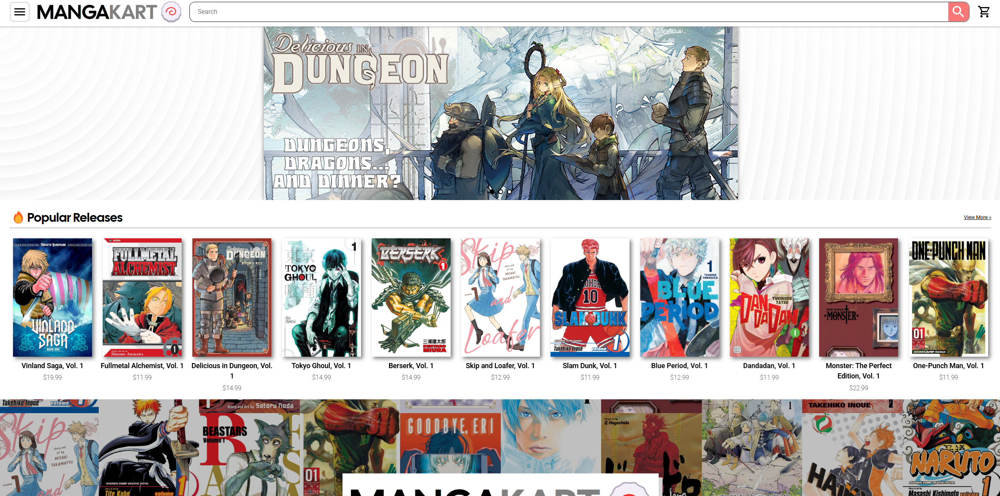
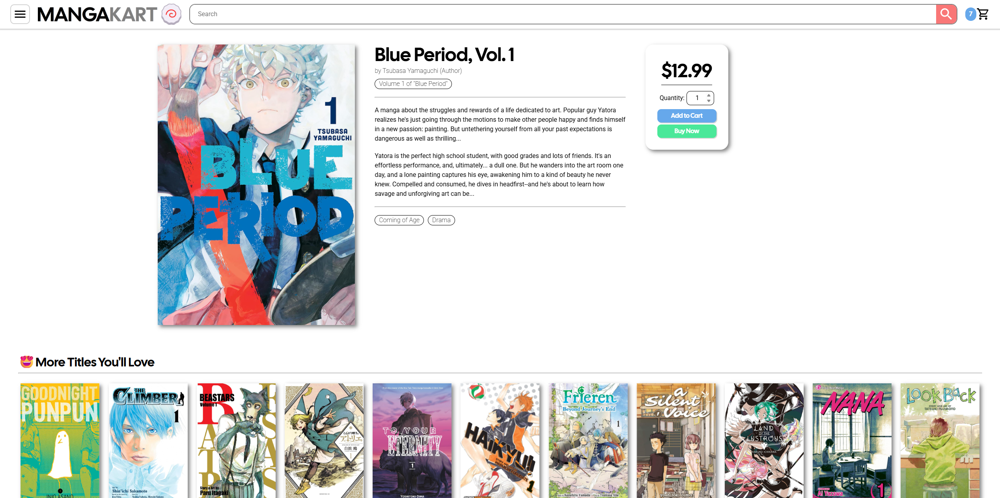
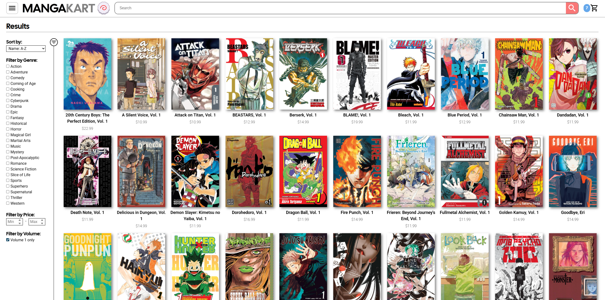
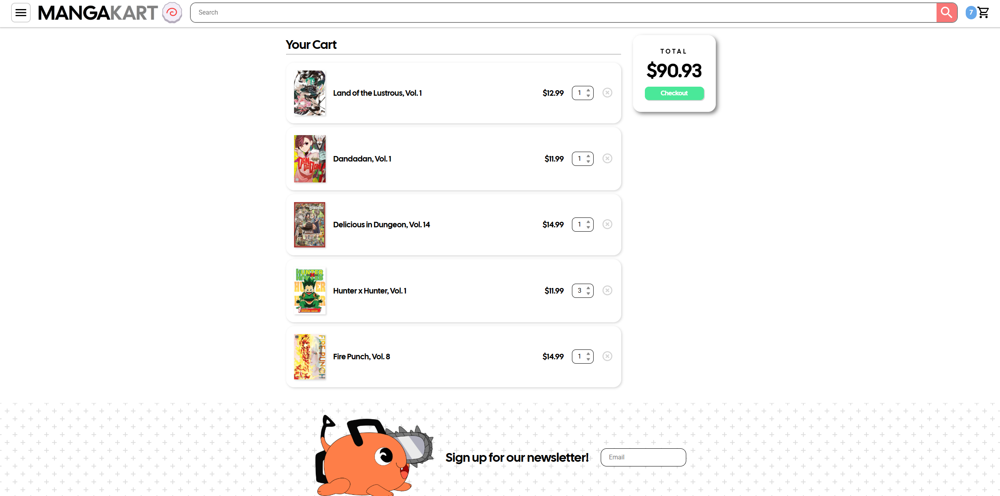

# 📔 MangaKart | Interactive E-Commerce Storefront



> A highly interactive, fully responsive e-commerce frontend built to handle complex state management, client-side routing, and advanced product filtering. 

**[🔴 View Live Demo](https://mangakart.netlify.app/)** | **[🌐 View Developer Portfolio](https://vilay.dev)**

## 🚀 Tech Stack

* **Frontend:** React, JavaScript (ES6+), Vanilla CSS3
* **Routing:** React Router DOM v6
* **Build Tool:** Vite
* **Libraries:** React Toastify, Canvas Confetti
* **Tooling:** Node.js (Custom CLI Data Generator)
* **Testing:** Vitest

## 🎯 Core Features

* **URL-Synced Search & Filter Engine:** The search page features a complex filtering system (by genre, price, volume, and name) that automatically syncs with the browser's URL using `URLSearchParams`. This allows users to share direct links to highly specific search queries and preserves browser history.
* **Global State Management:** Cart and store data are hoisted to the root level and seamlessly distributed using React Router's `useOutletContext`, completely avoiding prop-drilling without the overhead of external libraries like Redux. 
* **Persistent Cart Logic:** Cart state is synced with `localStorage`, ensuring user data persists across sessions. Features dynamic quantity adjustments and real-time total calculations.
* **Custom Node.js Data Generator:** Built a custom command-line interface script (`mangaEntry.js`) using Node's `readline` and `fs` modules to rapidly generate structured JSON mock data for the store inventory.
* **Interactive UI/UX:** Features a custom CSS architecture with parallax scroll effects (`requestAnimationFrame`), auto-scrolling carousels, and responsive CSS Grid/Flexbox layouts.

## 🧠 Architecture & Challenges

**The Challenge:** Managing complex search, filtering, sorting, and pagination simultaneously across a large dataset. Because backend databases and SQL had not yet been introduced in the curriculum, all data querying and manipulation had to be handled entirely on the client side, while still ensuring the UI stayed snappy and the browser's "Back" button functioned correctly.

**The Solution:** Instead of storing the filter states purely in React state (which breaks on page reload), I tethered the search parameters to the URL. I implemented a debounced `useEffect` hook (300ms delay) that intercepts user input and updates the URL search parameters gracefully. To handle the heavy lifting of client-side data filtering without a database, the `filteredStoreData` is wrapped in a `useMemo` hook. This prevents expensive re-calculations on every render, ensuring smooth performance even when sorting the entire product catalog locally.

## 🛠️ Local Setup

To run this project locally, follow these steps:

1. **Clone the repository:**
```bash
git clone https://github.com/arvilays/shopping-cart.git
```

2. **Navigate to the directory:**
```bash
cd shopping-cart
```

3. **Install dependencies:**
```bash 
npm install
```

4. **Start the development server:**
```bash
npm run dev
```

**Generate Mock Data (Optional):**

To use the custom Node.js script to generate new product entries for the database:
  ```bash
  node src/scripts/mangaEntry.js
 ```

## 📷 Screenshots



